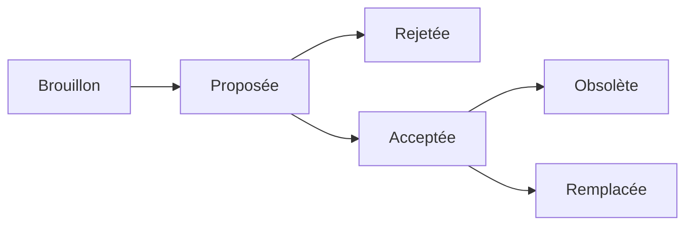

# Decisions

## Définitions 
Une décision architecturale (DA) est un choix de conception d'un logiciel qui répond à une exigence fonctionnelle ou non fonctionnelle importante sur le plan architectural. 

Un enregistrement de décision architecturale [ADR](httsp://adr.github.io) capture une seule décision architecturale, comme c'est souvent le cas lors de la rédaction de notes personnelles ou de comptes rendus de réunions ; l'ensemble des ADR créés et conservés dans le cadre d'un projet constitue son journal des décisions. 

**Un ADR est immuable** : seul son statut peut changer (c'est-à-dire qu'il peut devenir obsolète ou supplanté). Ainsi, vous pouvez vous familiariser avec l'historique complet du projet en lisant simplement son journal de décisions dans l'ordre chronologique. 

En outre, le maintien de cette documentation vise à : 
- 🚀 Améliorer et accélérer l'intégration d'un nouveau membre de l'équipe 
- 🔭 Éviter l'acceptation/le retour aveugle d'une décision passée  
- 🤝 Formaliser le processus de décision de l'équipe

## Utilisations
Ce site web est automatiquement mis à jour après un changement sur la branche *main* du dépôt Git du projet. Chaque ADR est représenté par markdown.

Le statut d'une ADR peut avoir les états suivants :

Quelques formats possibles :

* [adr-template.md](adr-template.md) has all sections, with explanations about them.
* [adr-template-minmal.md](adr-template-minimal.md) only contains mandatory sections, with explanations about them. <!-- ### Consequences also contained, though marked as "optional" -->
* [adr-template-bare.md](adr-template-bare.md) has all sections, wich are empty (no explanations).
* [adr-template-bare-minimal.md](adr-template-bare-minimal.md) has the mandatory sections, without explanations. <!-- ### Consequences also contained, though marked as "optional" -->

La documentation MADR est disponible sur le [site](https://adr.github.io/madr/). .
