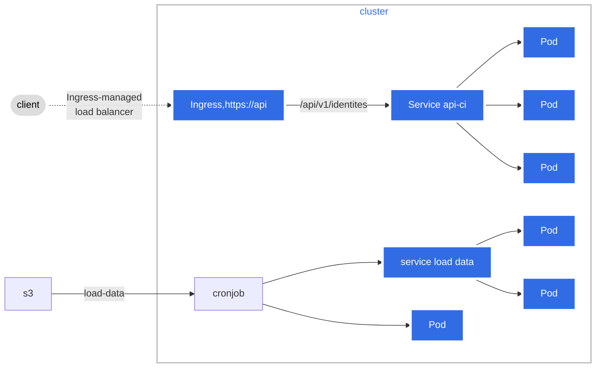
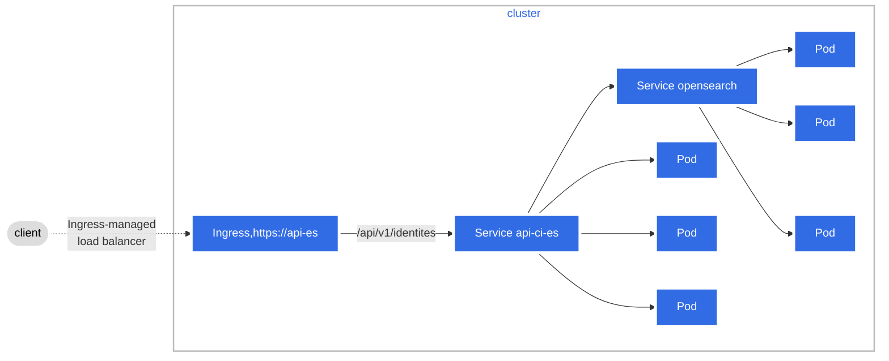

# ADR-002: [TCNP] traitement et mode d'exposition

- Status: accepted
- Date: 2023-10-10

## Context and Problem Statement
*contexte et énoncé du problème*

Effectuer la correspondance d'identités entre les données de l'INSEE (RNIP) et les données d'un système tiers métiers. Les critères de recherche sont limitées au nom, prénom, date de naissance et lieu de naissance.

Les données sont mises à jour mensuellement par l'INSEE qui les met à disposition entre le 1er et 15 de chaque mois depuis un portail accessible par login/password


**système** :

- est accessible en interne de l'entreprise;
- doit servir une seule application métier rapidement par rapport au contexte sportif;
- authentifier l'application métier

**volumétrie prévue** :

- plus de 300 000 changements d'identités (initialement prévu 70 000);
- 2 millions d'enquêtes annuelles

**contraintes** :

- format des données différent entre les données sources (présence de tirets, d'apostrophes) et les données métiers (absence de tiret, d'aspostrohe);
- le mode de requêtage se construit de manière itérative et doit être pour l'instant très adaptables.
  

Faut-il intégrer des principes de recherches approximatives et de scoring ?
   
## Decision Drivers
*facteurs de décisions*

Faute de développeurs (internet/externe) il est nécessaire de minimiser au maximum le développement compte tenu des délais pour une mise en production et une homologation en décembre 2023.

L'application doit être maintenue par la service Team.

## Considered Options
*options envisagées*

  - option 1 : API et données en mémoire (ex: utilisation de pandas, polar)
    - avantages : s3 est le seul point de stockage;
    - inconvénients : empreinte mémoire importante compte tenu de l'évolution de la volumétrie  



- option 2 : API et elasticsearch/opensearch
  
    - avantages : recherche approchante en utilisant la méthode de recherche par distance (*jaro-winkler* ou *levenshtein*);
    - inconvénients: définir un seuil et une méthode de scoring
   
 ```mermaid
graph LR;
    s3-->cronjob;
    cronjob-->opensearch;
 
```
> note: chargement des données



  - option 3 : La base de base de données directement exposée via postgrest https://postgrest.org/en/v11/.
    - avantages :
      - rapidité de mise en oeuvre;
      - accepte nativement les recherches de type égal (*.eq*) ou contient (*.like* ou *.ilike*) 
    - inconvénients : 
      - préparation de données (noms, prénoms) spécifiques aux ré-utilisateurs
      - format de requêtage des api non standards

## Decision Outcome
*Résultat de la décision*

  **L'option numéro 3 est choisie.**

## Consequences

La prise en compte de nouveaux consommateurs de l'API nécessite l'ajout de nouvelles données préparées et adaptées aux consommateurs.
